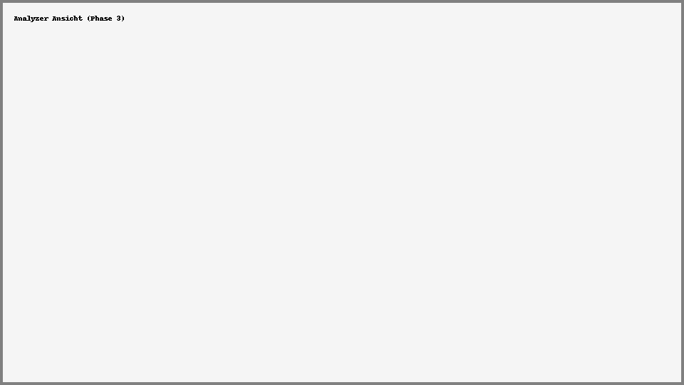

# Power Apps YAML Analyzer

**Version:** 3.1.0  
**Letztes Update:** 2025-05-14  
**Phase:** 3 – Visualisierung & Dokumentation

---

## 🔍 Projektbeschreibung

Dieses Tool analysiert `fx.yaml`-Dateien aus Power Apps Canvas-Apps offline im Browser.  
Es dient der strukturierten Prüfung, Visualisierung und Dokumentation von Komponenten, Navigationslogik, Funktionen und Audit-Strukturen.

---

## ✅ Funktionen nach Phase

### 📦 Phase 1 – Grundstruktur
- YAML-Zeilenparser
- Anzeige aller Zeilen als Property/Value
- Basisprüfung

### 🧠 Phase 2 – Logikprüfung & KPI
- Variable Tracking (`Set`, `UpdateContext`)
- Funktions-Erkennung (`Patch`, `Collect`, `Filter`, ...)
- Pflichtfeldprüfung (`IsBlank`)
- KPI-Funktionen (`Sum`, `CountRows`, `DateDiff`)

### 🧱 Phase 3 – Visualisierung & Dokumentation
- TreeMap Komponentenstruktur (Screen, Label, ComboBox, Form, ...)
- Audit-Tags: `scrAudit`, `scrReferenz`, `scrDashboard`, `scrPaletten`
- Navigationspfade (`Navigate(...)`)
- Markdown-Dokumentation generieren
- Dropdown für Phase-Auswahl

---

## 📸 Screenshots

| Hauptmodul | Vorschau |
|------------|----------|
| Analyzer (Phase 3) |  |
| Markdown Export |  |

---

## 🚀 Verwendung

1. `canvas-analyse.html` im Browser öffnen
2. fx.yaml-Code aus Power Platform CLI oder VS Code einfügen
3. Analyse starten → alle Ergebnisse werden direkt angezeigt

---

## 📂 Struktur

| Ordner | Inhalt |
|--------|--------|
| `/src` | HTML-Analyzer |
| `/docs` | Dokumentation, Screenshots |
| `/exports` | Analyse-Ergebnisse als `.yaml`, `.csv`, `.json` |

---

## 🛣️ Roadmap

- 📎 Phase 4: Accordion-Ansicht, PDF-Export, Flussdiagramm
- 🌐 `.msapp`-Komponente zur Power Apps-Integration
- 📋 GitHub-Issues + Labelstruktur zur Erweiterungsplanung

---

Erstellt für: **Dome**  
Verantwortlicher Bereich: **LKW-Audit, Palettenmanagement, Logistikprozessanalyse**
